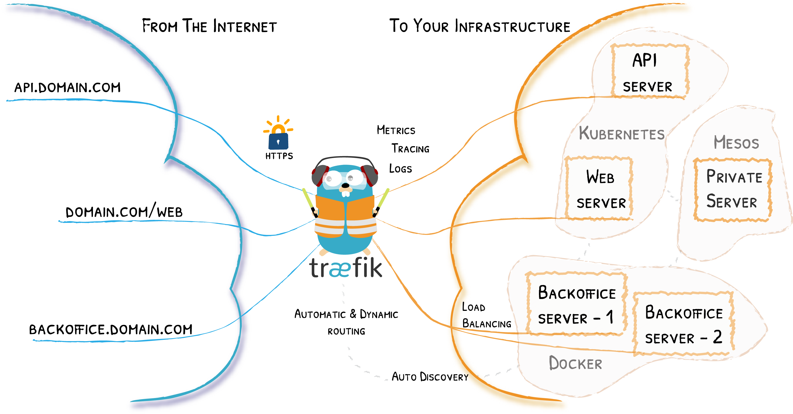

# stack-containers

Provisionamento de containers gerenciado pelo portainer + traefik usando TLS.

## Tecnlologias e requisitos:
- Docker - https://www.docker.com/
- Docker-compose - https://docs.docker.com/compose/
- Portainer - https://www.portainer.io/
- Traefik - https://github.com/traefik/traefik
- mkcert - ferramenta para criar certificados de desenvolvimento localmente confiáveis.  https://github.com/FiloSottile/mkcert
- edição do arquivo `hosts` do sistema (simulando um DNS local)

Basicamente criamos um deploy do traefik para gerenciar as coenxoes com um dominio local. (*.local.test)



Passos a seguir consideram já o Docker e o docker-compose instalados no sistema. 

###  gerando certificado local
Instalar o mkcert no sistema operacional utilizado:
Windows (utilizando winget): abra o prompt de comando do windows e digite:
```
winget install mkcert -s winget 
```

Instalando autoridade certificadora local
```
mkcert -install
```
Gerando certificado para os dominios (exemplo utilizado: local.test).
Gerar o o certifcado a partir da pasta `core`. Os certificados vao ser armazenados na pasta `certs`.

```
cd core
mkcert -cert-file certs/local-cert.pem -key-file certs/local-key.pem "local.test" "*.local.test" "cloud.local" "*.cloud.local"
```

###  Iniciando o traefik e o portainer
A partir da posta core digitar os seguintes comandos:

Criar uma rede do tipo bridge (padrão do docker), porém com um nome. (exemplo utilizado: traefik-proxy)
```
docker network create traefik-proxy
```

Verificar se o arquivo de manifesto está ok (a saida é o próprio manifesto yml.):
```
docker-compose config
```

Iniciar a stack core com o parametro -d (Detached mode) rodando em background. A partir da pasta core, executar:
```
docker-compose up -d
```

Editar o arquivo hosts e inserir os dominios locais (template pode ser encontrado na poasta docs):

Windows - abrir o nodepad como administrador
```
C:\Windows\System32\drivers\etc\hosts
```
```
Start-Process notepad -Argument C:\Windows\System32\drivers\etc\hosts -Verb RunAs
```

Linux e Mac - editar usando sudo
```
\etc\hosts
```

Abrir o navegador e digitar a url:
```
http://portainer.local.test
```

